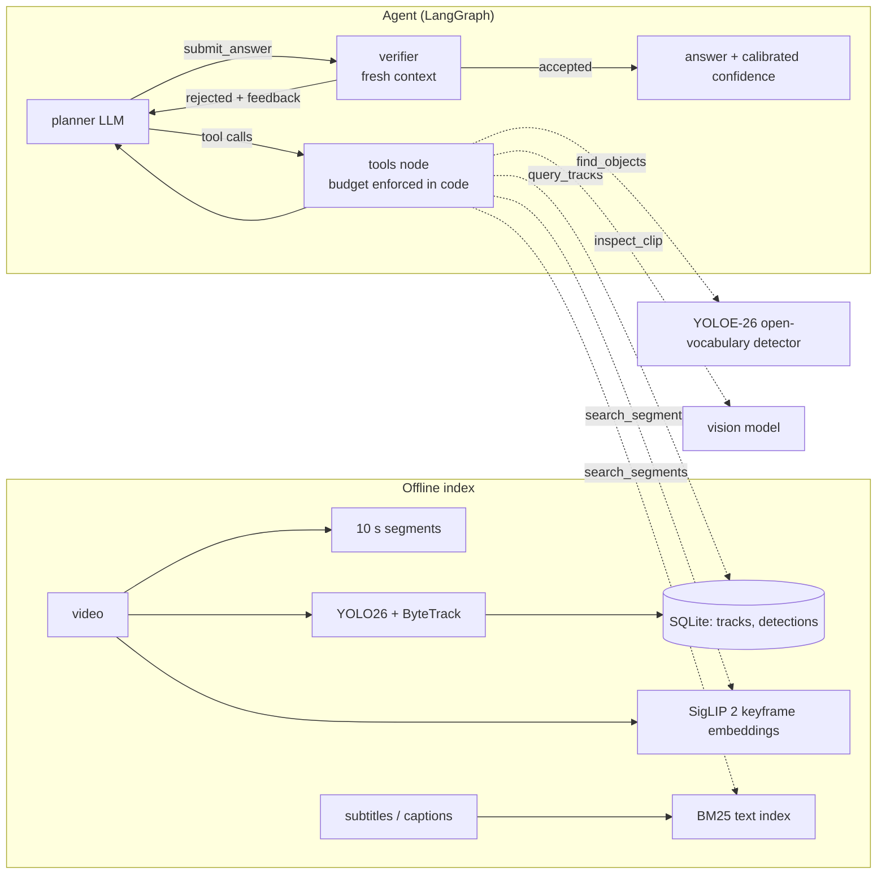

# VideoScout

A tool-using agent that answers questions about long videos. Instead of stuffing
uniformly sampled frames into one VLM call, it **searches** for where the answer
might be, **looks** at those moments with a vision model, and has an independent
**verifier** check the answer against what it actually saw, all under an explicit
tool-call and frame budget.

**Live demo: <https://elena-jc.github.io/videoscout/>** replays recorded agent runs
in the browser (static page, no API calls). Run it locally to ask your own questions.



## What is in it

| Piece | Implementation |
|---|---|
| Orchestration | LangGraph state machine: planner, tools, verifier, nudge and forced-answer nodes; append-only transcript |
| Tools | `search_segments`, `query_tracks`, `find_objects`, `inspect_clip`, served in-process or over **MCP** (stdio, SDK 2.x) |
| Retrieval | Hybrid: SigLIP 2 (so400m) text-to-frame (MaxSim over keyframes) + BM25 over subtitles, object tags and captions, fused with Reciprocal Rank Fusion, diversified with temporal MMR; multilingual queries |
| Structured memory | YOLO26 detection + ByteTrack, summarised per track (duration, path length, displacement), queried with read-only SQL behind five guardrails (read-only handle, SQLite authorizer, single statement, timeout, row cap) |
| Open-vocabulary grounding | `find_objects` runs YOLOE-26 with text prompts (MobileCLIP2 text encoder) on any time window, for objects outside the 80 COCO classes; returns boxes the agent can zoom into |
| Perception | Vision sub-agent: frames never enter the planner context; zoom onto a tracked object or a detected box |
| Reliability | Pydantic-validated tool arguments, strict tool schemas, structured outputs, verifier with calibrated confidence, budget enforcement, forced-answer fallback |
| LLM plumbing | Claude Opus 5.5 with adaptive thinking and per-role effort, prompt caching, server-side refusal fallback, Batches API for offline captioning, per-question token and cost accounting |
| Evaluation | Uniform-frame VLM baseline, ablation switches, accuracy / selective accuracy / coverage / ECE / cost, grounding hit rates, failure taxonomy, resumable runs |

## Web app

Windows: double-click `start.bat` (elsewhere: `python -m videoscout.web`). The browser
opens a local page where you add videos, ask questions, and watch every agent step
live over Server-Sent Events; evidence timestamps seek the player. Indexing and agent
runs are background jobs; the server only listens on 127.0.0.1.

Spending is capped locally before any request is sent (`models.daily_request_limit`,
`models.daily_cost_limit_usd`, ledger in `.cache/usage/`), on top of provider quotas.

`python -m videoscout.web.export` turns recorded eval runs into a static site that
replays them (what the live demo above is), so it can be hosted for free without
exposing an API key.

## Quickstart

```bash
python -m venv .venv && .venv/Scripts/activate      # Linux/macOS: source .venv/bin/activate
pip install torch torchvision --index-url https://download.pytorch.org/whl/cu126   # or the CPU build
pip install -e ".[index,eval,dev]"
cp .env.example .env                                 # then paste your API key(s) into .env

python scripts/make_demo_video.py --out data/demo    # 2-minute synthetic demo + 5 questions
python -m videoscout index data/demo/demo.mp4 --srt data/demo/demo.srt --out indexes/demo
python -m videoscout ask --index indexes/demo "What does the sign at the entrance say?" \
    -o "A. GATE A OPEN" -o "B. GATE B CLOSED" -o "C. EXIT ONLY" -o "D. NO PARKING"
```

### Other model providers (including free ones)

Any OpenAI-compatible endpoint works through `videoscout/llm_openai.py`; pick a config:

```bash
export GEMINI_API_KEY=...    # free tier from https://aistudio.google.com/apikey
python -m videoscout ask --config configs/gemini.yaml --index indexes/demo "What does the sign say?" -o "A. GATE A OPEN" -o "B. GATE B CLOSED"
python -m videoscout ask --config configs/ollama.yaml --index indexes/demo "..."   # fully local, no key
```

Report which model produced each result; numbers from different models are not comparable.

Use the tools from Claude Code (or any MCP client):

```bash
claude mcp add videoscout -- python -m videoscout.tools.mcp_server --index indexes/demo
```

Model weights download on first use into `weights/` (Ultralytics) and `.cache/huggingface/` (SigLIP 2) inside the project; run commands from the project root.

## Model choices

| Role | Default | Why | Alternatives |
|---|---|---|---|
| Closed-set detection + tracking (offline) | YOLO26-s + ByteTrack | Newest Ultralytics generation, end-to-end (no NMS), real-time on a laptop GPU | RF-DETR (Apache-2.0 licence), BoT-SORT with ReID for fewer ID switches |
| Open-vocabulary detection (query time) | YOLOE-26-s | Text-prompted detection at YOLO speed; covers objects the index never tracked | Grounding DINO / OWLv2 (slower), SAM 3 (concept segmentation + video tracking; heavier, gated weights) |
| Text-to-frame retrieval | SigLIP 2 so400m/14@384 | Stronger retrieval than SigLIP, multilingual | SigLIP 2 base for CPU-only machines, Perception Encoder |
| Planner / verifier / vision | Claude Opus 5.5 | Strong multi-step tool use and vision | Any OpenAI-compatible endpoint (Gemini, local Qwen3-VL via Ollama) |

The agent design is what this project is about; every perception model is a swappable component behind a tool.

## Evaluation

```bash
# baseline: 32 uniformly sampled frames, one VLM call
python -m videoscout.eval.run --data data/demo/qa.jsonl --method uniform --frames 32 --out runs/uniform32
# full agent, then ablations
python -m videoscout.eval.run --data data/demo/qa.jsonl --method agent --index-root indexes --out runs/agent
python -m videoscout.eval.run --data data/demo/qa.jsonl --method agent --out runs/no_verify --set agent.verify=false
python -m videoscout.eval.run --data data/demo/qa.jsonl --method agent --out runs/no_bm25 --set retrieval.use_bm25=false
python -m videoscout.eval.run --data data/demo/qa.jsonl --method agent --out runs/no_tracks --set agent.disabled_tools=query_tracks
python -m videoscout.eval.report runs/uniform32 runs/agent runs/no_verify runs/no_bm25 runs/no_tracks --out runs/report.md
```

For a real benchmark, convert Video-MME (long split) and build indexes on the fly:

```bash
python -m videoscout.eval.data --parquet videomme/test-00000-of-00001.parquet --video-dir videomme/data \
    --subtitle-dir videomme/subtitle --duration long --max-videos 30 --out data/videomme_long30.jsonl
python -m videoscout.eval.run --data data/videomme_long30.jsonl --method agent --build-missing --out runs/vmme_agent
```

### Results

_Not run yet. Fill this table from `runs/report.md`; every number should come from a run in `runs/`._

| method | acc % | selective acc % | coverage % | ECE | tool calls | frames | $/question |
|---|---|---|---|---|---|---|---|
| uniform 32 frames | | | | | 0 | 32 | |
| agent (full) | | | | | | | |
| agent, no verifier | | | | | | | |
| agent, no BM25 | | | | | | | |
| agent, no track SQL | | | | | | | |

## Layout

```
videoscout/
  agent/        graph.py (LangGraph agent), react_minimal.py (the same loop in 50 lines), prompts, state
  tools/        search, SQL, inspect; registry; MCP server and client
  retrieval/    BM25, hybrid retriever (RRF + MMR)
  index/        segmenting, SigLIP, YOLO + ByteTrack, subtitles, captions, SQLite store
  eval/         data loaders, baseline, runner, report
  llm.py        Claude wrapper (effort, caching, fallback, cost)
  web/          local web app (Starlette, SSE, background jobs) and static export
  spend.py      local daily request / cost caps
tests/          60 unit tests (never call an API); `pytest -m integration` runs real YOLO26 / YOLOE / SigLIP 2
docs/WALKTHROUGH.md   design notes and interview prep (Chinese)
```

## Notes

- Ultralytics YOLO is AGPL-3.0; keep that in mind before using this code in a closed-source product.
- Tests never call the API: the model is replaced by a scripted fake that also enforces the tool-use protocol.
- On Windows with a very long project path, create the virtualenv somewhere short (DLL loading is limited to 260 characters).
