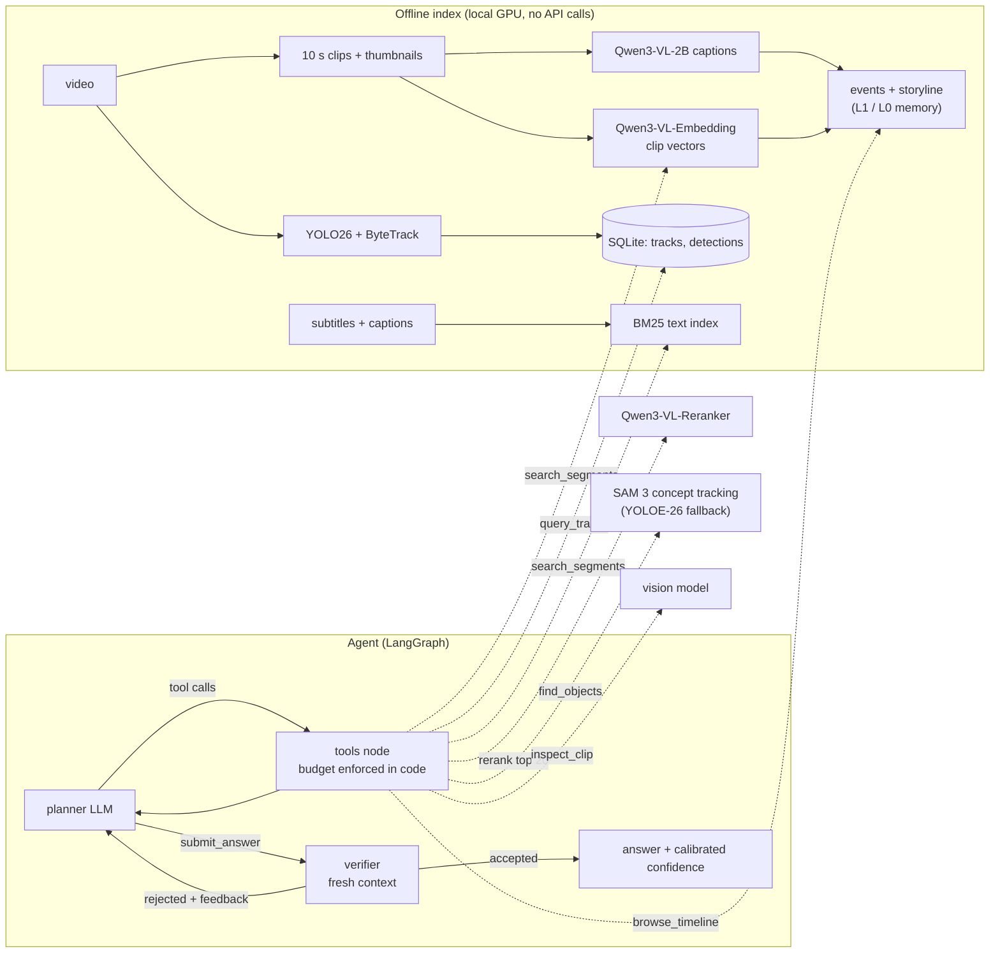

# VideoScout

A tool-using agent that answers questions about long videos. Instead of stuffing
uniformly sampled frames into one VLM call, it keeps the video as a **multi-granular
memory** (storyline, events, clips, frames), **searches** it coarse-to-fine, **looks**
at the few moments that matter with a vision model, and has an independent
**verifier** check the answer against what it actually saw, all under an explicit
tool-call and frame budget.

**Live demo: <https://elena-jc.github.io/videoscout/>** replays recorded agent runs
in the browser (static page, no API calls). Run it locally to ask your own questions.



## What is in it

| Piece | Implementation |
|---|---|
| Orchestration | LangGraph state machine: planner, tools, verifier, nudge and forced-answer nodes; append-only transcript |
| Tools | `browse_timeline`, `search_segments`, `query_tracks`, `find_objects`, `inspect_clip`, served in-process or over **MCP** (stdio, SDK 2.x) |
| Multi-granular memory | L0 storyline, L1 events (clips grouped where adjacent clip embeddings change, adaptive threshold), L2 clips (captions, subtitles, object tags), L3 frames on demand; built offline by a local Qwen3-VL-2B, browsed by the agent without spending frames (the coarse-to-fine design of Deep Video Discovery / VideoSeek) |
| Retrieval | Qwen3-VL-Embedding clip vectors (frames + text of each clip) and BM25, fused with Reciprocal Rank Fusion, **reranked** by a Qwen3-VL cross-encoder over the top 20, diversified with temporal MMR; SigLIP 2 keyframe MaxSim kept as an ablation baseline |
| Structured memory | YOLO26 detection + ByteTrack as the cheap always-on tier, summarised per track, queried with read-only SQL behind five guardrails (read-only handle, SQLite authorizer, single statement, timeout, row cap) |
| Open-vocabulary grounding | `find_objects` runs **SAM 3** concept segmentation + tracking on a window (distinct instances with identities kept across frames), or YOLOE-26 per-frame detection when SAM 3 weights are absent |
| Perception | Vision sub-agent: frames never enter the planner context; zoom onto a tracked object or a detected box |
| Local GPU sharing | One large model on an 8 GB GPU at a time; idle ones are parked in RAM, short text queries are embedded on the CPU so the reranker keeps the GPU (search: ~10 s -> 1.5 s) |
| Reliability | Pydantic-validated tool arguments, strict tool schemas, structured outputs, verifier with calibrated confidence, budget enforcement, forced-answer fallback |
| LLM plumbing | Claude Opus 5.5 (adaptive thinking, per-role effort, prompt caching, refusal fallback, Batches API) or any OpenAI-compatible endpoint (Gemini, Ollama); per-question token and cost accounting; local daily spend caps |
| Evaluation | LVBench / Video-MME converters; retrieval-only Recall@k against annotated time spans (free, local); end-to-end QA vs uniform frames and **Gemini's native video modes** (static and agentic); ablations, selective accuracy, ECE, grounding hit rates, failure taxonomy, resumable runs |

## Web app

Windows: double-click `start.bat` (elsewhere: `python -m videoscout.web`). The browser
opens a local page where you add videos, ask questions, and watch every agent step
live over Server-Sent Events; a timeline under the player marks what the agent
retrieved, inspected and cited. Indexing and agent runs are background jobs; the
server only listens on 127.0.0.1.

Spending is capped locally before any request is sent (`models.daily_request_limit`,
`models.daily_cost_limit_usd`, ledger in `.cache/usage/`), on top of provider quotas.

`python -m videoscout.web.export` turns recorded eval runs into a static site that
replays them (what the live demo above is), so it can be hosted for free without
exposing an API key.

## Quickstart

```bash
python -m venv .venv && .venv/Scripts/activate      # Linux/macOS: source .venv/bin/activate
pip install torch torchvision --index-url https://download.pytorch.org/whl/cu126   # or the CPU build
pip install -e ".[index,eval,dev]"
cp .env.example .env                                 # then paste your API key(s) into .env

python scripts/make_demo_video.py --out data/demo    # 2-minute synthetic demo + 5 questions
python -m videoscout index data/demo/demo.mp4 --srt data/demo/demo.srt --out indexes/demo
python -m videoscout ask --index indexes/demo "What does the sign at the entrance say?" \
    -o "A. GATE A OPEN" -o "B. GATE B CLOSED" -o "C. EXIT ONLY" -o "D. NO PARKING"
```

The first index downloads the local models (~13 GB: Qwen3-VL-Embedding-2B,
Qwen3-VL-Reranker-2B, Qwen3-VL-2B-Instruct, SigLIP 2, YOLO26) into `.cache/huggingface/`
and `weights/` inside the project. An 8 GB GPU is enough. SAM 3 is optional: request
access to `facebook/sam3` on Hugging Face, add `HF_TOKEN=...` to `.env`, and download
it once; until then `find_objects` uses YOLOE-26.

### Other model providers (including free ones)

Any OpenAI-compatible endpoint works through `videoscout/llm_openai.py`; pick a config:

```bash
export GEMINI_API_KEY=...    # free tier from https://aistudio.google.com/apikey
python -m videoscout ask --config configs/gemini.yaml --index indexes/demo "What does the sign say?" -o "A. GATE A OPEN" -o "B. GATE B CLOSED"
python -m videoscout ask --config configs/ollama.yaml --index indexes/demo "..."   # fully local, no key
```

Report which model produced each result; numbers from different models are not comparable.

Use the tools from Claude Code (or any MCP client):

```bash
claude mcp add videoscout -- python -m videoscout.tools.mcp_server --index indexes/demo
```

## Model choices

| Role | Default | Why | Alternatives |
|---|---|---|---|
| Clip retrieval | Qwen3-VL-Embedding-2B (2026) | One vector per clip from its frames *and* text, so motion and speech count; instruction-aware; Apache-2.0 | 8B variant (stronger, needs a bigger GPU), SigLIP 2 keyframes (kept as baseline), Perception Encoder |
| Reranking | Qwen3-VL-Reranker-2B (2026) | Cross-encoder reads query and clip together: precise where bi-encoders are coarse; only on the top 20 | 8B variant, an LLM judge (slower, costs tokens) |
| Captions, events, storyline | Qwen3-VL-2B-Instruct, local | Builds the text memory for free on the indexing GPU; the agent treats it as a map, not evidence | Any VLM through `index.captioner: llm` (API cost) |
| Open-vocabulary grounding | SAM 3 (Meta, Nov 2025) | Detects, segments and tracks every instance of a noun phrase; identities give real counts and durations | YOLOE-26 (faster, per-frame only; the automatic fallback), Grounding DINO |
| Always-on detection + tracking | YOLO26-s + ByteTrack | Cheap first tier over the whole video (COCO classes); the heavy open-vocabulary model only runs on demand | RF-DETR (more accurate on GPU, Apache-2.0), BoT-SORT with ReID |
| Planner / verifier / vision | Claude Opus 5.5 | Strong multi-step tool use and vision | Gemini (free tier, `configs/gemini.yaml`), local Qwen3-VL via Ollama |

The agent design is what this project is about; every perception model is a swappable component behind a tool.

## Evaluation

```bash
# baseline: 32 uniformly sampled frames, one VLM call
python -m videoscout.eval.run --data data/demo/qa.jsonl --method uniform --frames 32 --out runs/uniform32
# full agent, then ablations
python -m videoscout.eval.run --data data/demo/qa.jsonl --method agent --index-root indexes --out runs/agent
python -m videoscout.eval.run --data data/demo/qa.jsonl --method agent --out runs/no_verify --set agent.verify=false
python -m videoscout.eval.run --data data/demo/qa.jsonl --method agent --out runs/no_timeline --set agent.disabled_tools=browse_timeline
python -m videoscout.eval.run --data data/demo/qa.jsonl --method agent --out runs/no_rerank --set retrieval.rerank=false
python -m videoscout.eval.report runs/uniform32 runs/agent runs/no_verify runs/no_timeline runs/no_rerank --out runs/report.md
```

### LVBench (hour-long videos, annotated time spans)

LVBench questions come with the time span that contains the answer, so retrieval can
be scored on its own, locally and for free, and the agent's grounding can be checked.

```bash
# annotations: https://huggingface.co/datasets/zai-org/LVBench (video_info.meta.jsonl); videos are YouTube ids
python -m videoscout.eval.data lvbench --meta video_info.meta.jsonl --video-dir data/lvbench/videos \
    --max-videos 10 --per-video 15 --out data/lvbench/qa.jsonl
# 1. retrieval only (no API calls): Recall@1/@5 and MRR per retrieval configuration
python -m videoscout.eval.retrieval --data data/lvbench/qa.jsonl --index-root indexes \
    --configs bm25 keyframe clip keyframe+bm25 clip+bm25 clip+bm25+rerank --out runs/retrieval.md
# 2. end-to-end QA: the agent against Gemini watching the whole video itself
python -m videoscout.eval.run --config configs/gemini.yaml --data data/lvbench/qa.jsonl --method agent --build-missing --out runs/lvb_agent
python -m videoscout.eval.run --config configs/gemini.yaml --data data/lvbench/qa.jsonl --method gemini-native --processing agentic --out runs/lvb_native_agentic
python -m videoscout.eval.run --config configs/gemini.yaml --data data/lvbench/qa.jsonl --method gemini-native --processing static --fps 0.5 --out runs/lvb_native_static
```

Video-MME works the same way (`python -m videoscout.eval.data videomme --parquet ...`).

### Results

_Not run yet. Fill these tables from `runs/retrieval.md` and `runs/report.md`; every number should come from a run in `runs/`._

| method | acc % | selective acc % | coverage % | ECE | tool calls | frames | input tokens |
|---|---|---|---|---|---|---|---|
| uniform 32 frames | | | | | 0 | 32 | |
| Gemini native, static | | | | | 0 | - | |
| Gemini native, agentic | | | | | 0 | - | |
| agent (full) | | | | | | | |
| agent, no verifier | | | | | | | |
| agent, no timeline memory | | | | | | | |
| agent, no reranker | | | | | | | |

## Layout

```
videoscout/
  agent/        graph.py (LangGraph agent), react_minimal.py (the same loop in 50 lines), prompts, state
  tools/        browse_timeline, search, SQL, find_objects (SAM 3 / YOLOE), inspect; registry; MCP server and client
  retrieval/    BM25, hybrid retriever (dense + BM25, RRF, rerank, MMR)
  index/        clips, memory (events + storyline), Qwen3-VL embedder / reranker / captioner, SigLIP 2, YOLO + ByteTrack, SQLite store
  eval/         benchmark converters, retrieval eval, baselines (uniform, Gemini native), runner, report
  gpu.py        sharing one small GPU between local models
  llm.py        Claude wrapper (effort, caching, fallback, cost); llm_openai.py for OpenAI-compatible APIs
  web/          local web app (Starlette, SSE, background jobs) and static export
  spend.py      local daily request / cost caps
tests/          68 unit tests (never call an API or load model weights); `pytest -m integration` runs the real models
docs/WALKTHROUGH.md   design notes and interview prep (Chinese)
```

## Notes

- Ultralytics YOLO is AGPL-3.0; keep that in mind before using this code in a closed-source product. SAM 3 weights have their own licence (Meta, gated).
- Tests never call the API: the model is replaced by a scripted fake that also enforces the tool-use protocol; local models are replaced by fakes too.
- On Windows with a very long project path, create the virtualenv somewhere short (DLL loading is limited to 260 characters).
